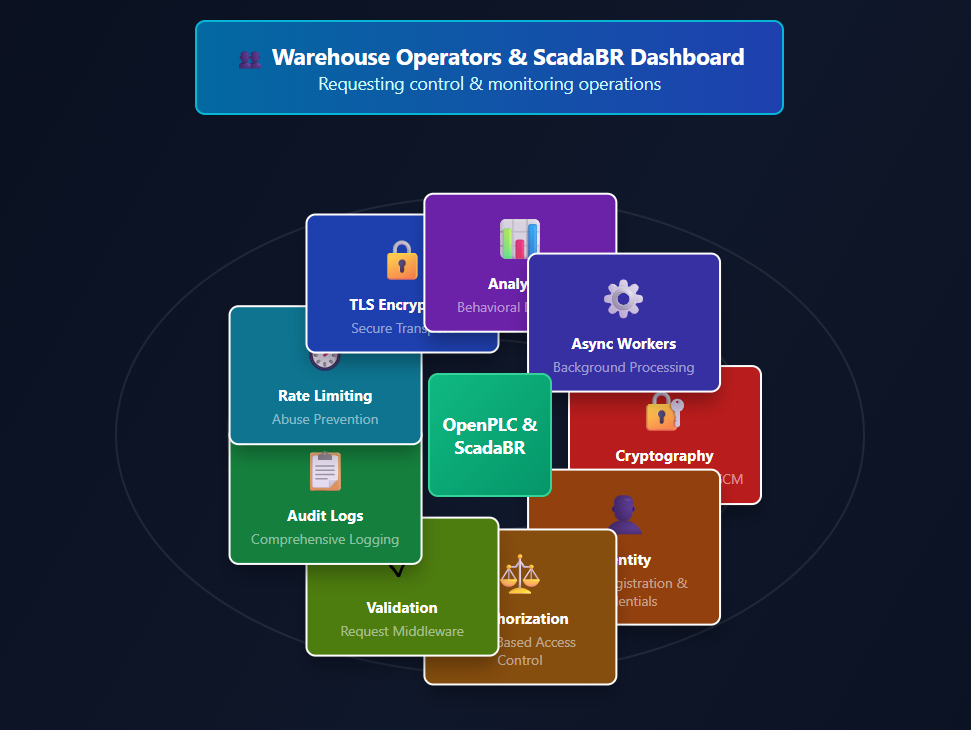

# Strands Zero-Trust Security Wrapper  
## Overview

The Strands Zero-Trust Security Wrapper is an enterprise-grade security extension that implements comprehensive zero-trust architecture principles for the Strands Agents SDK. This wrapper provides defense-in-depth security controls including cryptographic identity verification, fine-grained authorization, end-to-end encryption, continuous behavioral monitoring, and immutable audit logging.

#### [Visit Website](https://zero-trust-cybersecurity-g3hz.vercel.app/)

## Business Value

Modern distributed agent systems face significant security challenges including unauthorized access, data exfiltration, privilege escalation, and compromised credentials. Traditional perimeter-based security models fail to address threats from internal actors or compromised agents operating within the trusted network boundary.

This zero-trust wrapper transforms the security posture of Strands agent deployments by eliminating implicit trust assumptions. Every agent interaction undergoes rigorous authentication and authorization verification, regardless of network location or prior access history. This approach significantly reduces the attack surface and limits the potential damage from compromised agents or malicious insiders.

Organizations deploying this solution benefit from enhanced security compliance, reduced risk of data breaches, improved auditability for regulatory requirements, and increased confidence in agent-based automation systems. The wrapper enables secure deployment of Strands agents in highly regulated industries including financial services, healthcare, government, and critical infrastructure sectors.

## Key Features

### Identity and Access Management
The wrapper implements cryptographic identity verification for every agent instance using public key infrastructure. Each agent receives unique cryptographic credentials during initialization, enabling mutual authentication for all communications. The distributed identity registry maintains agent identities with support for credential lifecycle management including issuance, renewal, and revocation.

### Attribute-Based Access Control
Fine-grained authorization policies govern all agent operations based on multiple contextual factors. The policy engine evaluates agent attributes, resource sensitivity, environmental context, and temporal constraints to make real-time access control decisions. Policies are expressed in a declarative specification language enabling centralized management with distributed enforcement.

### End-to-End Encryption
All data handled by agents receives cryptographic protection both at rest and in transit. Inter-agent communications utilize TLS with mutual authentication and perfect forward secrecy. Data at rest employs authenticated encryption ensuring both confidentiality and integrity. The hierarchical key management system supports multiple encryption zones with different security classifications.

### Continuous Verification
The system performs ongoing validation of agent identities and behavior rather than one-time authentication. Periodic challenge-response protocols verify credential validity, while behavioral analysis detects anomalous patterns indicating potential compromise. Deviations from established baselines trigger automated investigation and response workflows.

### Immutable Audit Trail
Every security-relevant event generates a cryptographically signed audit log entry stored in a tamper-evident data structure. The audit system captures authentication attempts, authorization decisions, data access patterns, policy violations, and security incidents. Cryptographic chaining prevents undetected modification of historical records.

### Behavioral Analytics
Machine learning models establish baseline patterns for normal agent operations and detect deviations indicating potential security incidents. The analytics engine tracks API call patterns, data access frequencies, communication relationships, and resource utilization. Anomaly detection alerts security teams to investigate suspicious activity before damage occurs.

### Network Micro-Segmentation
Agents operate within minimal trust boundaries with explicit network policies controlling inter-agent communication. Service mesh architecture ensures all communications transit security proxies enforcing authentication, authorization, and encryption policies. Circuit breaker patterns and rate limiting protect against denial-of-service attacks.

### Dynamic Policy Management
Security policies update dynamically without requiring agent restarts, enabling rapid response to emerging threats. The centralized policy management system supports versioning, testing, and rollback capabilities. Policy changes propagate automatically to distributed enforcement points with eventual consistency guarantees.

## Architecture

The wrapper implements a layered security architecture that intercepts all Strands SDK operations and enforces zero-trust principles at each layer.

The identity layer manages agent credentials and provides authentication services. Agents receive cryptographic key pairs during initialization with public keys registered in the distributed identity service. All operations require presentation of valid credentials that undergo cryptographic verification before proceeding.

The authorization layer implements policy-based access control using an attribute-based authorization engine. Policies evaluate multiple factors including agent identity, requested operation, target resource, environmental context, and risk scores. The engine returns explicit allow or deny decisions with detailed reasoning captured in audit logs.

The encryption layer ensures data confidentiality and integrity throughout the system. Communication channels utilize TLS with mutual authentication, while data at rest receives authenticated encryption. Key management services handle cryptographic material lifecycle with support for rotation and secure deletion.

The audit layer captures comprehensive security telemetry for compliance and incident investigation. All security decisions, data access events, and anomalous behaviors generate structured log entries. Cryptographic signing and chaining ensure log integrity and prevent tampering.

The behavioral analysis layer monitors agent operations and detects anomalous patterns. Machine learning models trained on historical data identify deviations from normal behavior patterns. Security analysts receive alerts prioritized by risk score for investigation.

The orchestration layer coordinates security components and manages their interactions. Configuration management ensures consistent policy application across distributed enforcement points. Health monitoring detects component failures and triggers recovery procedures.

## Technology Stack
The Zero Trust Cybersecurity Wrapper project leverages a modern, multi-language technology stack optimized for secure, high-performance, and modular system design. The core implementation is written in Go, chosen for its strong concurrency model, efficient networking capabilities, and seamless integration with mTLS (Mutual TLS) for enforcing cryptographic identity verification between services. Open Policy Agent (OPA) is used as the policy enforcement engine, enabling fine-grained access control and dynamic decision-making based on contextual rules. The project also includes Python extensions that integrate with the Strands Agents SDK, allowing intelligent agent-based reasoning, security orchestration, and automation within the Zero Trust framework. Logging and observability are powered by Uber’s Zap for structured logging, while the system is designed to integrate easily with containerized environments such as Docker and Kubernetes for deployment. Together, this stack enables a secure, scalable, and intelligent infrastructure for implementing Zero Trust principles in distributed agent-based systems.

## Usage Examples

### Wrapping a Strands Agent
Initialize the zero-trust wrapper by importing the SecurityWrapper class and providing configuration including identity credentials, policy definitions, and encryption settings. Create an instance of the Strands SDK client and wrap it using the SecurityWrapper constructor. All subsequent operations through the wrapped client automatically enforce zero-trust security policies.

### Defining Security Policies
Security policies are expressed in YAML format with sections for subjects, resources, actions, and conditions. A subject identifies agents by identity, role, or attribute. Resources specify data objects, services, or operations being protected. Actions define the operations being attempted such as read, write, or execute. Conditions specify contextual requirements that must be satisfied such as time windows, network locations, or risk scores.

### Monitoring Security Events
The wrapper emits structured security events for monitoring and alerting. Subscribe to the security event stream to receive real-time notifications of authentication attempts, authorization decisions, policy violations, and detected anomalies. Events include detailed context enabling security teams to investigate incidents and respond appropriately.

### Handling Security Incidents
When the behavioral analysis engine detects anomalous activity, it generates security alerts with risk scores and supporting evidence. Security teams review alerts through the administrative interface which provides detailed visibility into agent behavior, access patterns, and policy evaluations. Incident response procedures leverage the wrapper's capabilities for credential revocation, agent isolation, and forensic investigation using immutable audit logs.

## Testing

The project maintains comprehensive test coverage across multiple testing dimensions. Unit tests verify individual components function correctly in isolation with proper error handling and edge case management. Integration tests validate that components work correctly together with realistic data flows. Security tests attempt to violate security properties and verify that defenses hold against attack scenarios. Performance tests measure overhead introduced by security controls and ensure acceptable latency characteristics.

Execute the complete test suite using `npm test` which runs all test categories and generates coverage reports. Run specific test categories with `npm run test:unit`, `npm run test:integration`, or `npm run test:security`. Continuous integration pipelines automatically execute tests on every commit with failures blocking merge to main branches.

## Security Considerations

The wrapper implements defense-in-depth security principles with multiple layers of protection. However, security is a shared responsibility requiring proper deployment, configuration, and operational practices. Organizations must secure the underlying infrastructure including container runtime, orchestration platform, and network infrastructure. Cryptographic key material requires protection using hardware security modules or secure key management services for production deployments.

Regular security assessments including penetration testing and vulnerability scanning should validate the effectiveness of security controls. Keep dependencies updated to address known vulnerabilities using automated dependency scanning and update workflows. Monitor security advisories for the Strands SDK and this wrapper, applying patches promptly when released.

Implement secure operational practices including principle of least privilege for administrative access, separation of duties for security-critical operations, regular audit log review and analysis, and incident response planning and testing. Integrate the wrapper's security telemetry with organizational security information and event management systems for comprehensive threat detection.
